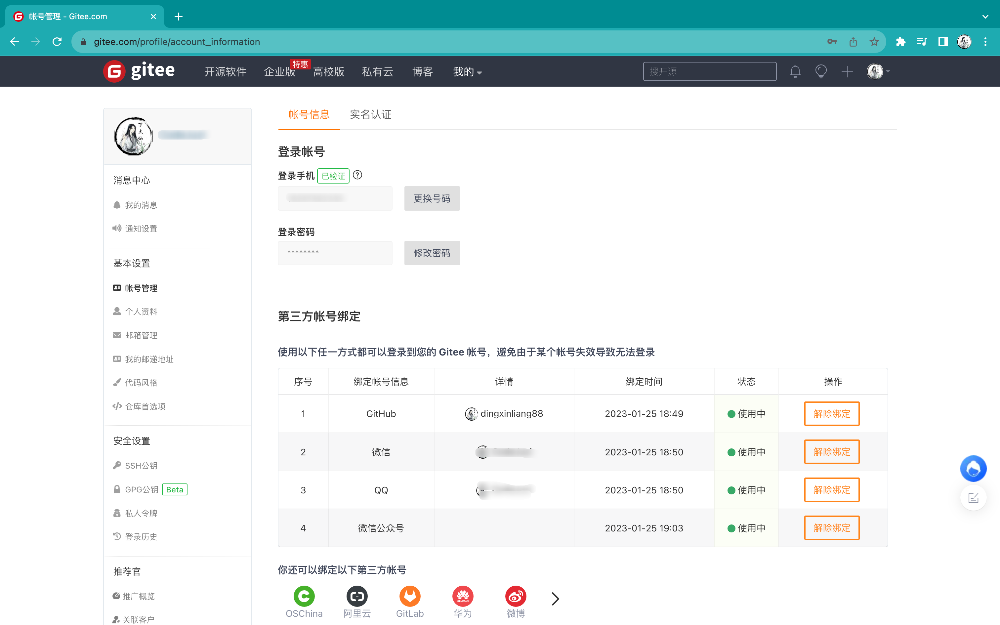

# OAuth2 实战

上期详细介绍了OAuth2的相关知识点，重点在OAuth2的授权模式（其中最重要的是授权码模式），这期我们就通过Demo的方式来实践下OAuth2认证协议。

仓库地址：https://github.com/dingxinliang88/oauth2-demo

SQL脚本 && Postman测试脚本：https://github.com/dingxinliang88/oauth2-demo/tree/master/doc

> 作者环境：
>
> - MacOS
> - Open JDK 11
> - Nacos 2.2.2
> - Maven 3.6.1
> - MySQL 8.0.31
> - Spring Boot 2.7.0
> - Spring Cloud 2021.0.1
> - Spring Cloud Alibaba 2021.0.1.0
> - IntelliJ IDEA Community Edition 2023.1.3

# 一、初始化项目

## 1.1 创建Maven项目

`pom.xml`核心内容：进行版本控制和工具类引入

```xml

<properties>
    <maven.compiler.source>11</maven.compiler.source>
    <maven.compiler.target>11</maven.compiler.target>
    <project.build.sourceEncoding>UTF-8</project.build.sourceEncoding>
    <spring.boot.version>2.7.0</spring.boot.version>
    <spring.cloud.version>2021.0.1</spring.cloud.version>
    <spring.cloud.alibaba.version>2021.0.1.0</spring.cloud.alibaba.version>
    <mysql.version>8.0.31</mysql.version>
</properties>

        <!--spring boot parent-->
<parent>
<groupId>org.springframework.boot</groupId>
<artifactId>spring-boot-starter-parent</artifactId>
<version>2.7.0</version>
<relativePath/>
</parent>

<dependencyManagement>
<dependencies>
    <!--spring cloud -->
    <dependency>
        <groupId>org.springframework.cloud</groupId>
        <artifactId>spring-cloud-dependencies</artifactId>
        <version>${spring.cloud.version}</version>
        <type>pom</type>
        <scope>import</scope>
    </dependency>
    <dependency>
        <groupId>com.alibaba.cloud</groupId>
        <artifactId>spring-cloud-alibaba-dependencies</artifactId>
        <version>${spring.cloud.alibaba.version}</version>
        <type>pom</type>
        <scope>import</scope>
    </dependency>

    <!--mysql-->
    <dependency>
        <groupId>com.mysql</groupId>
        <artifactId>mysql-connector-j</artifactId>
        <version>${mysql.version}</version>
    </dependency>
</dependencies>
</dependencyManagement>

<dependencies>
<!--util-->
<dependency>
    <groupId>org.projectlombok</groupId>
    <artifactId>lombok</artifactId>
</dependency>
<dependency>
    <groupId>org.apache.commons</groupId>
    <artifactId>commons-lang3</artifactId>
</dependency>
</dependencies>
```

## 1.2 数据库环境搭建

OAuth2环境需要的数据库脚本可以从官方仓库中找到：https://github.com/spring-attic/spring-security-oauth/blob/main/spring-security-oauth2/src/test/resources/schema.sql

此处作者稍稍做了优化，添加了模拟数据，下面是数据库(oauth)脚本文件内容`schema.sql`

```sql
/*
 Navicat Premium Data Transfer

 Source Server         : localhost
 Source Server Type    : MySQL
 Source Server Version : 80031
 Source Host           : localhost:3306
 Source Schema         : oauth

 Target Server Type    : MySQL
 Target Server Version : 80031
 File Encoding         : 65001

 Date: 08/08/2023 10:25:03
*/

SET NAMES utf8mb4;
SET FOREIGN_KEY_CHECKS = 0;

-- ----------------------------
-- Table structure for clientdetails
-- ----------------------------
DROP TABLE IF EXISTS `clientdetails`;
CREATE TABLE `clientdetails` (
  `appId` varchar(200) CHARACTER SET utf8mb3 COLLATE utf8mb3_general_ci NOT NULL,
  `resourceIds` varchar(256) CHARACTER SET utf8mb3 COLLATE utf8mb3_general_ci DEFAULT NULL,
  `appSecret` varchar(256) CHARACTER SET utf8mb3 COLLATE utf8mb3_general_ci DEFAULT NULL,
  `scope` varchar(256) CHARACTER SET utf8mb3 COLLATE utf8mb3_general_ci DEFAULT NULL,
  `grantTypes` varchar(256) CHARACTER SET utf8mb3 COLLATE utf8mb3_general_ci DEFAULT NULL,
  `redirectUrl` varchar(256) CHARACTER SET utf8mb3 COLLATE utf8mb3_general_ci DEFAULT NULL,
  `authorities` varchar(256) CHARACTER SET utf8mb3 COLLATE utf8mb3_general_ci DEFAULT NULL,
  `access_token_validity` int DEFAULT NULL,
  `refresh_token_validity` int DEFAULT NULL,
  `additionalInformation` varchar(4096) CHARACTER SET utf8mb3 COLLATE utf8mb3_general_ci DEFAULT NULL,
  `autoApproveScopes` varchar(256) CHARACTER SET utf8mb3 COLLATE utf8mb3_general_ci DEFAULT NULL,
  PRIMARY KEY (`appId`) USING BTREE
) ENGINE=InnoDB DEFAULT CHARSET=utf8mb3 ROW_FORMAT=COMPACT;

-- ----------------------------
-- Records of clientdetails
-- ----------------------------
BEGIN;
COMMIT;

-- ----------------------------
-- Table structure for oauth_access_token
-- ----------------------------
DROP TABLE IF EXISTS `oauth_access_token`;
CREATE TABLE `oauth_access_token` (
  `token_id` varchar(256) CHARACTER SET utf8mb3 COLLATE utf8mb3_general_ci DEFAULT NULL,
  `token` blob,
  `authentication_id` varchar(200) CHARACTER SET utf8mb3 COLLATE utf8mb3_general_ci NOT NULL,
  `user_name` varchar(256) CHARACTER SET utf8mb3 COLLATE utf8mb3_general_ci DEFAULT NULL,
  `client_id` varchar(256) CHARACTER SET utf8mb3 COLLATE utf8mb3_general_ci DEFAULT NULL,
  `authentication` blob,
  `refresh_token` varchar(256) CHARACTER SET utf8mb3 COLLATE utf8mb3_general_ci DEFAULT NULL,
  PRIMARY KEY (`authentication_id`) USING BTREE
) ENGINE=InnoDB DEFAULT CHARSET=utf8mb3 ROW_FORMAT=COMPACT;

-- ----------------------------
-- Records of oauth_access_token
-- ----------------------------
BEGIN;
COMMIT;

-- ----------------------------
-- Table structure for oauth_approvals
-- ----------------------------
DROP TABLE IF EXISTS `oauth_approvals`;
CREATE TABLE `oauth_approvals` (
  `userId` varchar(256) CHARACTER SET utf8mb3 COLLATE utf8mb3_general_ci DEFAULT NULL,
  `clientId` varchar(256) CHARACTER SET utf8mb3 COLLATE utf8mb3_general_ci DEFAULT NULL,
  `scope` varchar(256) CHARACTER SET utf8mb3 COLLATE utf8mb3_general_ci DEFAULT NULL,
  `status` varchar(10) CHARACTER SET utf8mb3 COLLATE utf8mb3_general_ci DEFAULT NULL,
  `expiresAt` timestamp NOT NULL DEFAULT CURRENT_TIMESTAMP ON UPDATE CURRENT_TIMESTAMP,
  `lastModifiedAt` timestamp NOT NULL DEFAULT CURRENT_TIMESTAMP
) ENGINE=InnoDB DEFAULT CHARSET=utf8mb3 ROW_FORMAT=COMPACT;

-- ----------------------------
-- Records of oauth_approvals
-- ----------------------------
BEGIN;
COMMIT;

-- ----------------------------
-- Table structure for oauth_client_details
-- ----------------------------
DROP TABLE IF EXISTS `oauth_client_details`;
CREATE TABLE `oauth_client_details` (
  `client_id` varchar(200) CHARACTER SET utf8mb3 COLLATE utf8mb3_general_ci NOT NULL,
  `resource_ids` varchar(256) CHARACTER SET utf8mb3 COLLATE utf8mb3_general_ci DEFAULT NULL,
  `client_secret` varchar(256) CHARACTER SET utf8mb3 COLLATE utf8mb3_general_ci DEFAULT NULL,
  `scope` varchar(256) CHARACTER SET utf8mb3 COLLATE utf8mb3_general_ci DEFAULT NULL,
  `authorized_grant_types` varchar(256) CHARACTER SET utf8mb3 COLLATE utf8mb3_general_ci DEFAULT NULL,
  `web_server_redirect_uri` varchar(256) CHARACTER SET utf8mb3 COLLATE utf8mb3_general_ci DEFAULT NULL,
  `authorities` varchar(256) CHARACTER SET utf8mb3 COLLATE utf8mb3_general_ci DEFAULT NULL,
  `access_token_validity` int DEFAULT NULL,
  `refresh_token_validity` int DEFAULT NULL,
  `additional_information` varchar(256) CHARACTER SET utf8mb3 COLLATE utf8mb3_general_ci DEFAULT NULL,
  `autoapprove` varchar(256) CHARACTER SET utf8mb3 COLLATE utf8mb3_general_ci DEFAULT NULL,
  PRIMARY KEY (`client_id`) USING BTREE
) ENGINE=InnoDB DEFAULT CHARSET=utf8mb3 ROW_FORMAT=COMPACT;

-- ----------------------------
-- Records of oauth_client_details
-- ----------------------------
BEGIN;
INSERT INTO `oauth_client_details` (`client_id`, `resource_ids`, `client_secret`, `scope`, `authorized_grant_types`, `web_server_redirect_uri`, `authorities`, `access_token_validity`, `refresh_token_validity`, `additional_information`, `autoapprove`) VALUES ('18266668888', 'PHONE_NUMBER', '$2a$10$mDVS2QYmhzZa/YoGcput4.xhESQCleIoRk1eSySFiwsDUV4Z.MrOu', 'web', 'refresh_token,client_credentials', NULL, 'PHONE_NUMBER', NULL, NULL, NULL, NULL);
INSERT INTO `oauth_client_details` (`client_id`, `resource_ids`, `client_secret`, `scope`, `authorized_grant_types`, `web_server_redirect_uri`, `authorities`, `access_token_validity`, `refresh_token_validity`, `additional_information`, `autoapprove`) VALUES ('dingxinliang01', 'USER_PASSWORD', '$2a$10$94rQmlAeO5Ur4qAKAzmew.SYtbYhPap5i6P3shTzpD61TZEAuJHTq', 'web', 'refresh_token,password', NULL, 'USER_PASSWORD', NULL, NULL, NULL, NULL);
INSERT INTO `oauth_client_details` (`client_id`, `resource_ids`, `client_secret`, `scope`, `authorized_grant_types`, `web_server_redirect_uri`, `authorities`, `access_token_validity`, `refresh_token_validity`, `additional_information`, `autoapprove`) VALUES ('GITEE-codejuzi', 'THIRD_PARTY', '$2a$10$ukYD1AorKH6ZBQm5J49XsOw7AdHpOGnBQFr6ao6Nt.VF7bTiJSq5O', 'web', 'refresh_token,client_credentials', NULL, 'THIRD_PARTY', NULL, NULL, NULL, NULL);
COMMIT;

-- ----------------------------
-- Table structure for oauth_client_token
-- ----------------------------
DROP TABLE IF EXISTS `oauth_client_token`;
CREATE TABLE `oauth_client_token` (
  `token_id` varchar(256) CHARACTER SET utf8mb3 COLLATE utf8mb3_general_ci DEFAULT NULL,
  `token` blob,
  `authentication_id` varchar(200) CHARACTER SET utf8mb3 COLLATE utf8mb3_general_ci NOT NULL,
  `user_name` varchar(256) CHARACTER SET utf8mb3 COLLATE utf8mb3_general_ci DEFAULT NULL,
  `client_id` varchar(256) CHARACTER SET utf8mb3 COLLATE utf8mb3_general_ci DEFAULT NULL,
  PRIMARY KEY (`authentication_id`) USING BTREE
) ENGINE=InnoDB DEFAULT CHARSET=utf8mb3 ROW_FORMAT=COMPACT;

-- ----------------------------
-- Records of oauth_client_token
-- ----------------------------
BEGIN;
COMMIT;

-- ----------------------------
-- Table structure for oauth_code
-- ----------------------------
DROP TABLE IF EXISTS `oauth_code`;
CREATE TABLE `oauth_code` (
  `code` varchar(256) CHARACTER SET utf8mb3 COLLATE utf8mb3_general_ci DEFAULT NULL,
  `authentication` blob
) ENGINE=InnoDB DEFAULT CHARSET=utf8mb3 ROW_FORMAT=COMPACT;

-- ----------------------------
-- Records of oauth_code
-- ----------------------------
BEGIN;
COMMIT;

-- ----------------------------
-- Table structure for oauth_refresh_token
-- ----------------------------
DROP TABLE IF EXISTS `oauth_refresh_token`;
CREATE TABLE `oauth_refresh_token` (
  `token_id` varchar(256) CHARACTER SET utf8mb3 COLLATE utf8mb3_general_ci DEFAULT NULL,
  `token` blob,
  `authentication` blob
) ENGINE=InnoDB DEFAULT CHARSET=utf8mb3 ROW_FORMAT=COMPACT;

-- ----------------------------
-- Records of oauth_refresh_token
-- ----------------------------
BEGIN;
COMMIT;

-- ----------------------------
-- Table structure for user
-- ----------------------------
DROP TABLE IF EXISTS `user`;
CREATE TABLE `user` (
  `id` int NOT NULL AUTO_INCREMENT,
  `passwd` varchar(265) CHARACTER SET utf8mb3 COLLATE utf8mb3_general_ci NOT NULL,
  `user_name` varchar(256) CHARACTER SET utf8mb3 COLLATE utf8mb3_general_ci NOT NULL,
  `user_role` varchar(255) CHARACTER SET utf8mb3 COLLATE utf8mb3_general_ci NOT NULL,
  `user_email` varchar(255) CHARACTER SET utf8mb3 COLLATE utf8mb3_general_ci DEFAULT NULL,
  `user_idcard` varchar(255) CHARACTER SET utf8mb3 COLLATE utf8mb3_general_ci DEFAULT NULL,
  `user_phone` varchar(15) CHARACTER SET utf8mb3 COLLATE utf8mb3_general_ci DEFAULT NULL,
  `user_province` varchar(255) CHARACTER SET utf8mb3 COLLATE utf8mb3_general_ci DEFAULT NULL,
  `vip_epoch` int NOT NULL,
  `vip_buy_date` datetime DEFAULT NULL,
  `vip_end_date` datetime DEFAULT NULL,
  `vip_status` int NOT NULL,
  `user_real_name` varchar(255) CHARACTER SET utf8mb3 COLLATE utf8mb3_general_ci DEFAULT NULL,
  PRIMARY KEY (`id`) USING BTREE
) ENGINE=InnoDB AUTO_INCREMENT=24 DEFAULT CHARSET=utf8mb3 ROW_FORMAT=COMPACT;

-- ----------------------------
-- Records of user
-- ----------------------------
BEGIN;
INSERT INTO `user` (`id`, `passwd`, `user_name`, `user_role`, `user_email`, `user_idcard`, `user_phone`, `user_province`, `vip_epoch`, `vip_buy_date`, `vip_end_date`, `vip_status`, `user_real_name`) VALUES (19, '$2a$10$94rQmlAeO5Ur4qAKAzmew.SYtbYhPap5i6P3shTzpD61TZEAuJHTq', 'dingxinliang01', 'USER_ROLE', NULL, NULL, '18266668888', NULL, 0, NULL, NULL, 0, NULL);
INSERT INTO `user` (`id`, `passwd`, `user_name`, `user_role`, `user_email`, `user_idcard`, `user_phone`, `user_province`, `vip_epoch`, `vip_buy_date`, `vip_end_date`, `vip_status`, `user_real_name`) VALUES (22, '', 'MALL_16913784274218888', 'PHONE_NUMBER', NULL, NULL, '18266668888', NULL, 0, NULL, NULL, 0, NULL);
INSERT INTO `user` (`id`, `passwd`, `user_name`, `user_role`, `user_email`, `user_idcard`, `user_phone`, `user_province`, `vip_epoch`, `vip_buy_date`, `vip_end_date`, `vip_status`, `user_real_name`) VALUES (23, '', 'GITEE-codejuzi', 'THIRD_PARTY', NULL, NULL, '18266668888', NULL, 0, NULL, NULL, 0, NULL);
COMMIT;

SET FOREIGN_KEY_CHECKS = 1;

```

上述数据库中，除`user`表之外，其余的表都是OAuth2的必备表，`user`表是可以根据实际业务去自定义的

## 1.3 Nacos环境准备

此处我们选择Nacos集群环境，具体的Nacos集群搭建过程可以查看[官网教程](https://github.com/dingxinliang88/oauth2-demo)
（最权威、最新的），如果你是MacOS（M系列芯片）用户，集群搭建有些许不同，具体的可以查看我的博客文章：https://www.codejuzi.icu/#/docs/envconfig/MacOS_Nacos_Cluster

# 二、OAuth2模块

## 2.1 搭建环境

创建OAuth2模块，`pom.xml`核心内容：

```xml

<properties>
    <maven.compiler.source>11</maven.compiler.source>
    <maven.compiler.target>11</maven.compiler.target>
    <project.build.sourceEncoding>UTF-8</project.build.sourceEncoding>
    <spring.cloud.oauth2.version>2.2.5.RELEASE</spring.cloud.oauth2.version>
</properties>

<dependencies>

<dependency>
    <groupId>org.springframework.boot</groupId>
    <artifactId>spring-boot-starter-web</artifactId>
</dependency>
<dependency>
    <groupId>com.alibaba.cloud</groupId>
    <artifactId>spring-cloud-starter-alibaba-nacos-discovery</artifactId>
</dependency>

<!-- spring security + oauth2 -->
<dependency>
    <groupId>org.springframework.boot</groupId>
    <artifactId>spring-boot-starter-security</artifactId>
</dependency>
<dependency>
    <groupId>org.springframework.cloud</groupId>
    <artifactId>spring-cloud-starter-oauth2</artifactId>
    <version>${spring.cloud.oauth2.version}</version>
</dependency>

<!-- jpa + mysql -->
<dependency>
    <groupId>com.mysql</groupId>
    <artifactId>mysql-connector-j</artifactId>
</dependency>
<dependency>
    <groupId>org.springframework.boot</groupId>
    <artifactId>spring-boot-starter-data-jpa</artifactId>
</dependency>

</dependencies>
```

> PS：不一定非要使用JPA，只是OAuth2模块的SQL查询使用JPA会比较方便


配置文件`application.yml`内容

```yaml
server:
  port: 8500

spring:
  application:
    name: oauth2-service
  cloud:
    nacos:
      discovery:
        server-addr: 192.168.0.100:8837,192.168.0.100:8848,192.168.0.100:8859
  datasource:
    driver-class-name: com.mysql.cj.jdbc.Driver
    url: jdbc:mysql://localhost:3306/oauth?useUnicode=true&characterEncoding=utf-8&useSSL=false&serverTimezone=UTC
    username: root
    password: 12345678
```

> PS：具体的数据库配置信息和Nacos地址信息以实际环境为准

## 2.2 创建实体类

前面说过，`user`表是我们自定义的，OAuth2并不知道有这张表的存在，因此我们需要去创建对应的实体类去操作这张表，其余的表格都是有OAuth2内部操作，不需要我们操心。

`User.java`

```java
package com.juzi.oauth2.pojo;

import lombok.Data;

import javax.persistence.*;

@Data
@Entity
@Table(name = "user")
public class User {

    @Id
    @GeneratedValue(strategy = GenerationType.IDENTITY)
    private Integer id;

    @Column(name = "user_name")
    private String userName;

    @Column(name = "passwd")
    private String passwd;

    @Column(name = "user_role")
    private String userRole;

}
```

> PS：此处为了操作方便，就只操作上述的几个字段，其余字段可以自行扩展哦~

## 2.3 OAuth2 + SpringSecurity 配置

SpringSecurity认证流程链：


因为我们的用户数据存储在数据库中，需要让SpringSecurity知道去数据库中查询用户信息，然后才能认证授权。因此我们需要去实现接口`org.springframework.security.core.userdetails.UserDetailsService`
，实现其中的`loadUserByUsername()`方法，从方法名也可以看出，是根据用户名去查询用户。

那么此时我们还需要知道用什么去查询，JDBC？MyBatis？我们刚刚引入的JPA这个时候就派上用场了，我们只需要定义一个接口，继承`org.springframework.data.jpa.repository.JpaRepository`
接口，指定实体类和主键类型，定义查询方法就可以了。

`UserRepository.java`

```java
package com.juzi.oauth2.repo;

import com.juzi.oauth2.pojo.User;
import org.springframework.data.jpa.repository.JpaRepository;
import org.springframework.stereotype.Repository;


@Repository
public interface UserRepository extends JpaRepository<User, Integer> {

    /**
     * 根据用户名查询用户
     *
     * @param userName 用户名
     * @return 用户信息
     */
    User queryByUserName(String userName);
}

```

至此，我们定义了从数据库查询用户信息的入口，接下来就应该实现`UserDetailService`接口，让SpringSecurity从数据库查询用户信息，进行认证授权了。

`UserDetailServiceImpl.java`

```java
package com.juzi.oauth2.service;

import com.juzi.oauth2.pojo.User;
import com.juzi.oauth2.repo.UserRepository;
import org.springframework.beans.factory.annotation.Autowired;
import org.springframework.security.core.authority.AuthorityUtils;
import org.springframework.security.core.userdetails.UserDetails;
import org.springframework.security.core.userdetails.UserDetailsService;
import org.springframework.security.core.userdetails.UsernameNotFoundException;
import org.springframework.stereotype.Service;

@Service
public class UserDetailServiceImpl implements UserDetailsService {

    @Autowired
    private UserRepository userRepository;

    @Override
    public UserDetails loadUserByUsername(String username) throws UsernameNotFoundException {
        User user = userRepository.queryByUserName(username);
        if (user == null) {
            throw new UsernameNotFoundException("User Not Found");
        }

        return new org.springframework.security.core.userdetails.User(
                user.getUserName(),
                user.getPasswd(),
                AuthorityUtils.createAuthorityList(user.getPasswd()));
    }
}
```

但是实现了接口就能够让SpringSecurity从数据库查询用户了吗？还不行，我们还需要将我们实现的类注册到SpringSecurity中，也就是配置。此处呢，我们需要编写配置类，继承`org.springframework.security.config.annotation.web.configuration.WebSecurityConfigurerAdapter`
配置类，重写其中的配置方法。

> PS：尽管WebSecurityConfigurerAdapter在Spring Security 5.7.1及更新版本或者Spring Boot
> 2.7.0及更新版本已经被弃用了，但是依然有很多项目使用它。当然，你也可以使用官方推荐的基于组件的（component-based）的安全配置去实现配置类，难度也不是很大，就是换了中写法而已啦。

`WebSecurityConfig.java`

```java
package com.juzi.oauth2.config;

import com.juzi.oauth2.service.UserDetailServiceImpl;
import org.springframework.beans.factory.annotation.Autowired;
import org.springframework.context.annotation.Bean;
import org.springframework.context.annotation.Configuration;
import org.springframework.security.authentication.AuthenticationManager;
import org.springframework.security.config.annotation.authentication.builders.AuthenticationManagerBuilder;
import org.springframework.security.config.annotation.web.builders.HttpSecurity;
import org.springframework.security.config.annotation.web.builders.WebSecurity;
import org.springframework.security.config.annotation.web.configuration.EnableWebSecurity;
import org.springframework.security.config.annotation.web.configuration.WebSecurityConfigurerAdapter;
import org.springframework.security.crypto.bcrypt.BCryptPasswordEncoder;
import org.springframework.security.crypto.password.PasswordEncoder;


@Configuration
@EnableWebSecurity
public class WebSecurityConfig extends WebSecurityConfigurerAdapter {


    @Autowired
    private UserDetailServiceImpl userDetailService;

    /**
     * 加密存储方式
     */
    @Bean
    public PasswordEncoder passwordEncoder() {
        return new BCryptPasswordEncoder();
    }

    @Override
    protected void configure(AuthenticationManagerBuilder auth) throws Exception {
        auth.userDetailsService(userDetailService)
                .passwordEncoder(passwordEncoder());
    }

    @Bean
    @Override
    protected AuthenticationManager authenticationManager() throws Exception {
        return super.authenticationManager();
    }

    @Override
    public void configure(WebSecurity web) {
        web.ignoring().antMatchers("/swagger-*");
    }

    @Override
    protected void configure(HttpSecurity http) throws Exception {
        http.authorizeHttpRequests().anyRequest().authenticated()
                .and().httpBasic()
                .and().cors()
                .and().csrf().disable();
    }
}

```

首先需要明确一点，用户密码是绝对不可以以明文的形式存储数据库的，此处我们采用BCryptPasswordEncoder的形式去加密存储，只需要注册一个PasswordEncoder
Bean即可。

```java
protected void configure(AuthenticationManagerBuilder auth)throws Exception{
        auth.userDetailsService(userDetailService)
        .passwordEncoder(passwordEncoder());
        }
```

上述代码就是在将我们实现的从数据库查询用户信息的类注册到SpringSecurity中，使得SpringSecurity调用我们实现的loadUserByUserName方法查询，同时还指定了密码的加密方式。

```java
public void configure(WebSecurity web){
        web.ignoring().antMatchers("/swagger-*");
        }

protected void configure(HttpSecurity http)throws Exception{
        http.authorizeHttpRequests().anyRequest().authenticated()
        .and().httpBasic()
        .and().cors()
        .and().csrf().disable();
        }
```

上述代码实在配置认证授权需要忽略的路径，以及配置http的简要内容，比如禁用csrf、开启跨域等等。

```java
@Bean
@Override
protected AuthenticationManager authenticationManager()throws Exception{
        return super.authenticationManager();
        }
```

上述代码是在注册AuthenticationManager类，至于作用嘛，我们先按下不表，等到进行OAuth2配置时自然就知道了。

至此为止，我们已经配置完了SpringSecurity，接下来就要配置OAuth2了。准备好了吗？发车了！

配置OAuth2需要我们去继承`org.springframework.security.oauth2.config.annotation.web.configuration.AuthorizationServerConfigurerAdapter`
类，复写其中的`configure`方法。

`Oauth2Config.java`

```java
package com.juzi.oauth2.config;

import com.juzi.oauth2.service.UserDetailServiceImpl;
import org.springframework.beans.factory.annotation.Autowired;
import org.springframework.context.annotation.Bean;
import org.springframework.context.annotation.Configuration;
import org.springframework.context.annotation.Primary;
import org.springframework.security.authentication.AuthenticationManager;
import org.springframework.security.oauth2.config.annotation.configurers.ClientDetailsServiceConfigurer;
import org.springframework.security.oauth2.config.annotation.web.configuration.AuthorizationServerConfigurerAdapter;
import org.springframework.security.oauth2.config.annotation.web.configuration.EnableAuthorizationServer;
import org.springframework.security.oauth2.config.annotation.web.configurers.AuthorizationServerEndpointsConfigurer;
import org.springframework.security.oauth2.config.annotation.web.configurers.AuthorizationServerSecurityConfigurer;
import org.springframework.security.oauth2.provider.ClientDetailsService;
import org.springframework.security.oauth2.provider.client.JdbcClientDetailsService;
import org.springframework.security.oauth2.provider.token.DefaultTokenServices;
import org.springframework.security.oauth2.provider.token.TokenStore;
import org.springframework.security.oauth2.provider.token.store.JdbcTokenStore;

import javax.sql.DataSource;

@Configuration
@EnableAuthorizationServer
public class Oauth2Config extends AuthorizationServerConfigurerAdapter {

    @Autowired
    public DataSource dataSource;

    @Autowired
    private UserDetailServiceImpl userDetailService;

    @Autowired
    private AuthenticationManager authenticationManager;

    /**
     * token配置
     */
    @Bean
    @Primary
    public DefaultTokenServices defaultTokenServices() {
        DefaultTokenServices defaultTokenServices = new DefaultTokenServices();
        // token 过期时间为 30day
        defaultTokenServices.setAccessTokenValiditySeconds(30 * 24 * 60 * 60);
        defaultTokenServices.setTokenStore(tokenStore());
        return defaultTokenServices;
    }

    @Override
    public void configure(ClientDetailsServiceConfigurer clients) throws Exception {
        clients.withClientDetails(clientDetails());
    }

    @Override
    public void configure(AuthorizationServerSecurityConfigurer security) {
        // 自定义安全配置：放行token检测的接口，
        security
                // 允许表单认证
                .allowFormAuthenticationForClients()
                // 允许客户端认证
                .checkTokenAccess("permitAll()");
    }

    @Override
    public void configure(AuthorizationServerEndpointsConfigurer endpoints) {
        endpoints.userDetailsService(userDetailService)
                .tokenServices(defaultTokenServices())
                .authenticationManager(authenticationManager);
    }

    /**
     * 存储token位置为mysql
     */
    @Bean
    public TokenStore tokenStore() {
        return new JdbcTokenStore(dataSource);
    }

    /**
     * 存储client_details, client_secret的位置
     */
    @Bean
    public ClientDetailsService clientDetails() {
        return new JdbcClientDetailsService(dataSource);
    }


}

```

> PS：我们这里采取默认的数据源，当然可以自定义数据源，比如Druid数据源。

```java
/**
 * 存储token位置为mysql
 */
@Bean
public TokenStore tokenStore(){
        return new JdbcTokenStore(dataSource);
        }

/**
 * 存储client_details, client_secret的位置
 */
@Bean
public ClientDetailsService clientDetails(){
        return new JdbcClientDetailsService(dataSource);
        }
```

因为我们的数据都存放在数据库中，因此需要指定token和client相关信息的存放位置为Jdbc，在本项目中也就是MySQL。

```java
@Bean
@Primary
public DefaultTokenServices defaultTokenServices(){
        DefaultTokenServices defaultTokenServices=new DefaultTokenServices();
        // token 过期时间为 30day
        defaultTokenServices.setAccessTokenValiditySeconds(30*24*60*60);
        defaultTokenServices.setTokenStore(tokenStore());
        return defaultTokenServices;
        }
```

上述代码是在配置默认的token管理器，注册了我们在上面提到的token存储位置的bean，设置了token过期时间等。

```java
@Override
public void configure(ClientDetailsServiceConfigurer clients)throws Exception{
        clients.withClientDetails(clientDetails());
        }
```

上述代码是在配置OAuth2中的Client Details的存储位置，这次设置为MySQL。

```java
@Override
public void configure(AuthorizationServerSecurityConfigurer security){
        // 自定义安全配置：放行token检测的接口，
        security
        // 允许表单认证
        .allowFormAuthenticationForClients()
        // 允许客户端认证
        .checkTokenAccess("permitAll()");
        }
```

上述代码是在进行安全配置，比如允许表单认证、允许客户端认证等。

```java
@Override
public void configure(AuthorizationServerEndpointsConfigurer endpoints){
        endpoints.userDetailsService(userDetailService)
        .tokenServices(defaultTokenServices())
        .authenticationManager(authenticationManager);
        }
```

因为OAuth2模块也是要从数据库读取用户信息和存取token的，因此需要在上述的终端配置endpoints中注册相关的bean，除此之外，还需要注册我们刚刚声明的认证管理器类AuthenticationManager，用于OAuth2认证。

至此OAuth2的配置也就结束了，接下来就是编写启动类，测试启动了（仅仅启动，并不做任何的请求，因为还有模块没写呢~）。

`Oauth2Application.java`

```java
package com.juzi.oauth2;

import org.springframework.boot.SpringApplication;
import org.springframework.boot.autoconfigure.SpringBootApplication;
import org.springframework.cloud.client.discovery.EnableDiscoveryClient;
import org.springframework.security.oauth2.config.annotation.web.configuration.EnableResourceServer;

@EnableDiscoveryClient
@SpringBootApplication
@EnableResourceServer
public class Oauth2Application {
    public static void main(String[] args) {
        SpringApplication.run(Oauth2Application.class, args);
    }
}
```

需要标注服务发现、资源服务器等注解。

# 三、通用模块

这一模块主要为了网关模块和用户模块做准备，定义通用返回类、返回工具类等公共类；这一模块不需要引入任何依赖，因此只需要默认的`pom.xml`
文件即可。

通用返回类`CommonResponse.java`

```java
package com.juzi.common.resp;

import lombok.Builder;
import lombok.Data;

@Data
@Builder
public class CommonResponse {

    private Integer code;

    private String msg;

    private Object content;
}

```

返回值枚举类`RespCodeEnum.java`

```java
package com.juzi.common.resp;

public enum RespCodeEnum {
    SUCCESS(200, "success"),
    BAD_REQUEST(400, "bad request"),
    UNAUTHORIZED(401, "unauthorized"),
    FORBIDDEN(403, "forbidden"),
    ;

    private final Integer code;

    private final String msg;

    RespCodeEnum(Integer code, String msg) {
        this.code = code;
        this.msg = msg;
    }

    public Integer getCode() {
        return code;
    }

    public String getMsg() {
        return msg;
    }
}

```

返回工具类`RespUtils.java`

```java
package com.juzi.common.resp;


public class RespUtils {

    public static CommonResponse success(Object content) {
        return CommonResponse.builder()
                .code(RespCodeEnum.SUCCESS.getCode())
                .msg(RespCodeEnum.SUCCESS.getMsg())
                .content(content)
                .build();
    }

    public static CommonResponse fail(Integer code, Object content, String msg) {
        return CommonResponse.builder()
                .code(code)
                .msg(msg)
                .content(content)
                .build();

    }

}
```

# 四、用户模块

## 4.1 搭建环境

`pom.xml`核心内容：

```xml

<properties>
    <maven.compiler.source>11</maven.compiler.source>
    <maven.compiler.target>11</maven.compiler.target>
    <project.build.sourceEncoding>UTF-8</project.build.sourceEncoding>
</properties>

<dependencies>
<dependency>
    <groupId>org.springframework.boot</groupId>
    <artifactId>spring-boot-starter-web</artifactId>
</dependency>
<dependency>
    <groupId>org.springframework.boot</groupId>
    <artifactId>spring-boot-configuration-processor</artifactId>
    <optional>true</optional>
</dependency>

<!--nacos-->
<dependency>
    <groupId>com.alibaba.cloud</groupId>
    <artifactId>spring-cloud-starter-alibaba-nacos-discovery</artifactId>
</dependency>

<!--http client-->
<dependency>
    <groupId>org.apache.httpcomponents</groupId>
    <artifactId>httpclient</artifactId>
</dependency>
<dependency>
    <groupId>org.springframework.cloud</groupId>
    <artifactId>spring-cloud-loadbalancer</artifactId>
</dependency>

<!--mysql + redis-->
<dependency>
    <groupId>com.mysql</groupId>
    <artifactId>mysql-connector-j</artifactId>
</dependency>
<dependency>
    <groupId>org.springframework.boot</groupId>
    <artifactId>spring-boot-starter-data-jpa</artifactId>
</dependency>
<dependency>
    <groupId>org.springframework.boot</groupId>
    <artifactId>spring-boot-starter-data-redis</artifactId>
</dependency>

<!--util-->
<dependency>
    <groupId>cn.hutool</groupId>
    <artifactId>hutool-all</artifactId>
    <version>5.8.21</version>
</dependency>

<!--common-->
<dependency>
    <groupId>com.juzi</groupId>
    <artifactId>common</artifactId>
    <version>0.0.1</version>
</dependency>
</dependencies>
```

`application.yml`

```yaml
server:
  port: 9001

spring:
  application:
    name: user-service
  cloud:
    nacos:
      discovery:
        server-addr: 192.168.0.100:8837,192.168.0.100:8848,192.168.0.100:8859
  datasource:
    driver-class-name: com.mysql.cj.jdbc.Driver
    url: jdbc:mysql://localhost:3306/oauth?useUnicode=true&characterEncoding=utf-8&useSSL=false&serverTimezone=UTC
    username: root
    password: 12345678
  redis:
    host: localhost
    port: 6379
    timeout: 10s
    lettuce:
      pool:
        max-active: 50
        max-idle: 50
        max-wait: -1ms
        min-idle: 0
```

> PS：Mysql、Nacos、Redis的具体配置还需要根据实际情形来调整哦~

## 4.2 业务需求

1）注册部分

1. 账号密码注册
2. 电话验证码注册
3. 第三方平台注册

2）登录部分

1. 账号密码登录

3）用户信息部分

1. 绑定电话

## 4.3 创建实体类和对应操作数据库Repo

用户模块我们需要操作两张表，分别是`user`和`oauth_client_details`，因此我们需要创建两个实体类。

`User.java`

```java
package com.juzi.user.pojo.po;

import lombok.AllArgsConstructor;
import lombok.Builder;
import lombok.Data;
import lombok.NoArgsConstructor;

import javax.persistence.*;
import java.util.Date;

@Data
@Builder
@NoArgsConstructor
@AllArgsConstructor
@Entity
@Table(name = "user")
public class User {
    @Id
    @GeneratedValue(strategy = GenerationType.IDENTITY)
    private Integer id;

    @Column(name = "passwd")
    private String passwd;

    @Column(name = "user_name")
    private String userName;

    @Column(name = "user_email")
    private String userEmail;

    @Column(name = "user_idcard")
    private String userIdCard;

    @Column(name = "user_role")
    private String userRole;

    @Column(name = "user_phone")
    private String userPhone;

    @Column(name = "user_province")
    private String userProvince;

    @Column(name = "vip_status")
    private int vipStatus;

    @Column(name = "vip_epoch")
    private int vipEpoch;

    @Column(name = "vip_buy_date")
    private Date vipBuyDate;

    @Column(name = "vip_end_date")
    private Date vipEndDate;
}

```

`OAuth2Client.java`

```java
package com.juzi.user.pojo.po;

import lombok.AllArgsConstructor;
import lombok.Builder;
import lombok.Data;
import lombok.NoArgsConstructor;

import javax.persistence.Column;
import javax.persistence.Entity;
import javax.persistence.Id;
import javax.persistence.Table;

@Data
@Builder
@NoArgsConstructor
@AllArgsConstructor
@Entity
@Table(name = "oauth_client_details")
public class OAuth2Client {
    @Id
    @Column(name = "client_id")
    private String clientId;

    @Column(name = "resource_ids")
    private String resourceIds;

    @Column(name = "client_secret")
    private String clientSecret;

    @Column(name = "scope")
    private String scope;

    @Column(name = "authorized_grant_types")
    private String authorizedGrantTypes;

    @Column(name = "web_server_redirect_uri")
    private String redirectUrl;

    @Column(name = "authorities")
    private String authorities;

    @Column(name = "access_token_validity")
    private Integer accessTokenValidity;

    @Column(name = "refresh_token_validity")
    private Integer refreshTokenValidity;

    @Column(name = "additional_information")
    private String additionalInfo;

    @Column(name = "autoapprove")
    private String autoApprove;
}

```

创建完实体类，就应该创建对应的JPA Repo类了

`UserRepository.java`

```java
package com.juzi.user.repo;

import com.juzi.user.pojo.po.User;
import org.springframework.data.jpa.repository.JpaRepository;
import org.springframework.stereotype.Repository;


@Repository
public interface UserRepository extends JpaRepository<User, Integer> {
}
```

`OAuth2ClientRepository.java`

```java
package com.juzi.user.repo;

import com.juzi.user.pojo.po.OAuth2Client;
import org.springframework.data.jpa.repository.JpaRepository;
import org.springframework.stereotype.Repository;


@Repository
public interface OAuth2ClientRepository extends JpaRepository<OAuth2Client, Integer> {
}
```

> PS：不要忘记标注注解@Repository

除此之外，我们还需要创建两个枚举类，分别是注册类别(RegisterType)、权限授予类别(AuthGrantType)

`RegisterType.java`

```java
package com.juzi.user.pojo.enums;

public enum RegisterType {
    USER_PASSWORD,
    PHONE_NUMBER,
    THIRD_PARTY
}

```

按照我们本项目的处理，注册类别分别是账号密码、手机验证码、第三方平台

`AuthGrantType.java`

```java
package com.juzi.user.pojo.enums;

public enum AuthGrantType {
    implicit,
    client_credentials,
    authorization_code,
    refresh_token,
    password
}
```

## 4.4 创建配置类和工具类

首先就是Redis的配置类`RedisConfig.java`，主要是配置Redis中的key和value的序列化方式

```java
package com.juzi.user.config;

import com.fasterxml.jackson.annotation.JsonAutoDetect;
import com.fasterxml.jackson.annotation.JsonTypeInfo;
import com.fasterxml.jackson.annotation.PropertyAccessor;
import com.fasterxml.jackson.databind.ObjectMapper;
import com.fasterxml.jackson.databind.jsontype.impl.LaissezFaireSubTypeValidator;
import org.springframework.context.annotation.Bean;
import org.springframework.context.annotation.Configuration;
import org.springframework.data.redis.connection.RedisConnectionFactory;
import org.springframework.data.redis.core.RedisTemplate;
import org.springframework.data.redis.serializer.Jackson2JsonRedisSerializer;
import org.springframework.data.redis.serializer.StringRedisSerializer;

@Configuration
public class RedisConfig {

    @Bean(name = "redisTemplate")
    public RedisTemplate<String, Object> redisTemplate(RedisConnectionFactory redisConnectionFactory) {
        RedisTemplate<String, Object> redisTemplate = new RedisTemplate<>();
        redisTemplate.setConnectionFactory(redisConnectionFactory);

        // 设置key的序列化方式
        StringRedisSerializer stringRedisSerializer = new StringRedisSerializer();
        redisTemplate.setKeySerializer(stringRedisSerializer);
        redisTemplate.setHashKeySerializer(stringRedisSerializer);

        // 设置value的序列化方式
        Jackson2JsonRedisSerializer<?> redisValueSerializer = new Jackson2JsonRedisSerializer<>(Object.class);
        ObjectMapper objectMapper = new ObjectMapper();
        objectMapper.setVisibility(PropertyAccessor.ALL, JsonAutoDetect.Visibility.ANY);
        objectMapper.activateDefaultTyping(LaissezFaireSubTypeValidator.instance,
                ObjectMapper.DefaultTyping.NON_FINAL, JsonTypeInfo.As.PROPERTY);
        redisValueSerializer.setObjectMapper(objectMapper);

        redisTemplate.setValueSerializer(redisValueSerializer);
        redisTemplate.setHashValueSerializer(redisValueSerializer);
        redisTemplate.afterPropertiesSet();

        return redisTemplate;
    }
}

```

因为我们要使用`RestTemplate`来发送HTTP请求，因此还需要配置RestTemplate，在此之前，我们先配置`HttpClient`
，目的就是替换掉RedisTemplate底层使用的URL Connection（JDK），适用于复杂场景。

`HttpClientConfig.java`

```java
package com.juzi.user.config;

import lombok.extern.slf4j.Slf4j;
import org.apache.commons.lang3.StringUtils;
import org.apache.http.HeaderElement;
import org.apache.http.client.config.RequestConfig;
import org.apache.http.config.Registry;
import org.apache.http.config.RegistryBuilder;
import org.apache.http.conn.ConnectionKeepAliveStrategy;
import org.apache.http.conn.socket.ConnectionSocketFactory;
import org.apache.http.conn.socket.PlainConnectionSocketFactory;
import org.apache.http.conn.ssl.SSLConnectionSocketFactory;
import org.apache.http.conn.ssl.TrustSelfSignedStrategy;
import org.apache.http.impl.client.CloseableHttpClient;
import org.apache.http.impl.client.HttpClients;
import org.apache.http.impl.conn.PoolingHttpClientConnectionManager;
import org.apache.http.message.BasicHeaderElementIterator;
import org.apache.http.protocol.HTTP;
import org.apache.http.ssl.SSLContextBuilder;
import org.springframework.context.annotation.Bean;
import org.springframework.context.annotation.Configuration;
import org.springframework.scheduling.annotation.Scheduled;

import java.security.KeyManagementException;
import java.security.KeyStoreException;
import java.security.NoSuchAlgorithmException;
import java.util.Objects;
import java.util.concurrent.TimeUnit;

@Slf4j
@Configuration
public class HttpClientConfig {

    /**
     * 连接超时时间（ms）
     */
    private static final int CONNECTION_TIMEOUT = 30000;

    /**
     * 请求超时时间（ms）
     */
    private static final int REQUEST_TIMEOUT = 30000;

    /**
     * socket 超时时间（ms）
     */
    private static final int SOCKET_TIMEOUT = 60000;

    /**
     * 最大连接数
     */
    private static final int MAX_CONNECTIONS = 50;

    /**
     * 默认 keep-alive 时间（ms）
     */
    private static final int DEFAULT_KEEP_ALIVE_TIME = 20000;

    /**
     * 清理空闲线程的任务定时时间（ms）
     */
    private static final int CLOSE_IDLE_CONN_TIME = 30000;


    @Bean
    public CloseableHttpClient httpClient() {
        RequestConfig config = RequestConfig.custom()
                .setConnectTimeout(CONNECTION_TIMEOUT)
                .setConnectionRequestTimeout(REQUEST_TIMEOUT)
                .setSocketTimeout(SOCKET_TIMEOUT)
                .build();

        return HttpClients.custom()
                .setDefaultRequestConfig(config)
                // pooling 线程池设置
                .setConnectionManager(poolingHttpClientConnectionManager())
                // keep-alive 设置
                .setKeepAliveStrategy(connectionKeepAliveStrategy())
                .build();
    }

    /**
     * 进行 http、 https 的注册， 设置最大连接数
     */
    @Bean
    public PoolingHttpClientConnectionManager poolingHttpClientConnectionManager() {
        SSLContextBuilder sslContextBuilder = new SSLContextBuilder();
        try {
            // 内部通信不需要 key-store(trust-store)
            sslContextBuilder.loadTrustMaterial(null, new TrustSelfSignedStrategy());
        } catch (NoSuchAlgorithmException | KeyStoreException e) {
            log.error("loadTrustMaterial error: ", e);
        }
        SSLConnectionSocketFactory sslConnectionSocketFactory = null;

        try {
            sslConnectionSocketFactory = new SSLConnectionSocketFactory(sslContextBuilder.build());
        } catch (NoSuchAlgorithmException | KeyManagementException e) {
            log.error("SSLConnectionSocketFactory create error: ", e);
        }

        @SuppressWarnings("DataFlowIssue") Registry<ConnectionSocketFactory> socketFactoryRegistry = RegistryBuilder
                .<ConnectionSocketFactory>create()
                .register("http", new PlainConnectionSocketFactory())
                .register("https", sslConnectionSocketFactory)
                .build();

        PoolingHttpClientConnectionManager poolingHttpClientConnectionManager
                = new PoolingHttpClientConnectionManager(socketFactoryRegistry);
        poolingHttpClientConnectionManager.setMaxTotal(MAX_CONNECTIONS);
        return poolingHttpClientConnectionManager;
    }

    @Bean
    public ConnectionKeepAliveStrategy connectionKeepAliveStrategy() {
        return (response, context) -> {
            BasicHeaderElementIterator iterator = new BasicHeaderElementIterator(response.headerIterator(HTTP.CONN_KEEP_ALIVE));
            while (iterator.hasNext()) {
                HeaderElement headerElement = iterator.nextElement();
                String name = headerElement.getName();
                String value = headerElement.getValue();
                if (StringUtils.isNotEmpty(value) && "timeout".equalsIgnoreCase(name)) {
                    return Long.parseLong(value) * 1000;
                }
            }
            return DEFAULT_KEEP_ALIVE_TIME;
        };
    }

    /**
     * 定时清理空闲线程（10s）
     */
    @Bean
    public Runnable idleConnCleaner(final PoolingHttpClientConnectionManager connectionManager) {
        return new Runnable() {
            @Override
            @Scheduled(fixedDelay = 10000L)
            public void run() {
                try {
                    if (!Objects.isNull(connectionManager)) {
                        connectionManager.closeExpiredConnections();
                        connectionManager.closeIdleConnections(CLOSE_IDLE_CONN_TIME, TimeUnit.MILLISECONDS);
                    } else {
                        log.warn("PoolingHttpClientConnectionManager is not initialized");
                    }
                } catch (Exception e) {
                    log.error("idleConnCleaner error: ", e);
                }
            }
        };
    }
}
```

至此，我们可以开始进行RestTemplate的配置了，`RestTemplateConfig.java`

```java
package com.juzi.user.config;

import org.apache.http.impl.client.CloseableHttpClient;
import org.springframework.beans.factory.annotation.Autowired;
import org.springframework.cloud.client.loadbalancer.LoadBalanced;
import org.springframework.context.annotation.Bean;
import org.springframework.context.annotation.Configuration;
import org.springframework.http.client.HttpComponentsClientHttpRequestFactory;
import org.springframework.http.converter.HttpMessageConverter;
import org.springframework.http.converter.StringHttpMessageConverter;
import org.springframework.web.client.RestTemplate;

import java.nio.charset.StandardCharsets;

@Configuration
public class RestTemplateConfig {

    /**
     * 替换RestTemplate底层使用的URL Connection（JDK），适用复杂场景
     */
    @Autowired
    private CloseableHttpClient httpClient;

    @Bean
    public HttpComponentsClientHttpRequestFactory clientHttpRequestFactory() {
        HttpComponentsClientHttpRequestFactory httpRequestFactory = new HttpComponentsClientHttpRequestFactory();
        httpRequestFactory.setHttpClient(httpClient);
        return httpRequestFactory;
    }

    @Bean(name = "innerRestTemplate")
    @LoadBalanced
    public RestTemplate innerRestTemplate() {
        RestTemplate restTemplate = new RestTemplate(clientHttpRequestFactory());
        for (HttpMessageConverter<?> messageConverter : restTemplate.getMessageConverters()) {
            if (messageConverter instanceof StringHttpMessageConverter) {
                // 一般接收 UTF-8 的消息
                ((StringHttpMessageConverter) messageConverter).setDefaultCharset(StandardCharsets.UTF_8);
            }
        }
        return restTemplate;
    }

    @Bean(name = "outerRestTemplate")
    public RestTemplate outerRestTemplate() {
        RestTemplate restTemplate = new RestTemplate(clientHttpRequestFactory());
        for (HttpMessageConverter<?> messageConverter : restTemplate.getMessageConverters()) {
            if (messageConverter instanceof StringHttpMessageConverter) {
                // 一般接收 UTF-8 的消息
                ((StringHttpMessageConverter) messageConverter).setDefaultCharset(StandardCharsets.UTF_8);
            }
        }
        return restTemplate;
    }

}

```

声明两个RestTemplate的原因是因为我们需要有两部分请求，一部分请求第三方平台的接口，这是外部接口，是不需要进行负载均衡的；而还有一部分请求是请求内部OAuth2接口，这是内部接口，是需要进行负载均衡的(
@LoadBalanced)

> PS：负载均衡的配置会在网关模块中进行


本项目中，我们还需要进行第三方平台（此处选择的是GITEE）的注册登录，因为还需要创建对应的配置类，并且以配置的形式注入。

```java
package com.juzi.user.config;

import lombok.Data;
import org.springframework.boot.context.properties.ConfigurationProperties;
import org.springframework.stereotype.Component;

@Data
@Component
@ConfigurationProperties(prefix = "third-party.gitee")
public class GiteeConfig {
    private String clientId;
    private String clientSecret;
    private String callBack;
    private String tokenUrl;
    private String userUrl;
    private String state;
}

```

具体的在`application.yml`中的配置，等到测试的时候再去申请对应的值即可。

至此，配置类完结，接下来就是操作Redis的工具类的编写，仅仅为了操作Redis的方便，`RedisCommonProcessor.java`

```java
package com.juzi.user.utils;

import org.apache.commons.lang3.StringUtils;
import org.springframework.beans.factory.annotation.Autowired;
import org.springframework.data.redis.core.RedisTemplate;
import org.springframework.stereotype.Component;

import java.util.concurrent.TimeUnit;

@Component
public class RedisCommonProcessor {

    @Autowired
    private RedisTemplate<String, Object> redisTemplate;

    public Object get(String key) {
        validateKey(key);
        return redisTemplate.opsForValue().get(key);
    }

    public void set(String key, Object value) {
        validateKey(key);
        redisTemplate.opsForValue().set(key, value);
    }

    public void set(String key, Object value, long time, TimeUnit timeUnit) {
        validateKey(key);
        if (time > 0) {
            redisTemplate.opsForValue().set(key, value, time, timeUnit);
        } else {
            set(key, value);
        }
    }

    public void setExpiredSeconds(String key, Object value, long seconds) {
        set(key, value, seconds, TimeUnit.SECONDS);
    }

    public void setExpiredMinutes(String key, Object value, long minutes) {
        set(key, value, minutes, TimeUnit.MINUTES);
    }

    public void setExpiredHours(String key, Object value, long hours) {
        set(key, value, hours, TimeUnit.HOURS);
    }

    public void setExpiredDays(String key, Object value, long days) {
        set(key, value, days, TimeUnit.DAYS);
    }

    public void remove(String key) {
        validateKey(key);
        redisTemplate.delete(key);
    }

    private void validateKey(String key) {
        if (StringUtils.isEmpty(key)) {
            throw new IllegalArgumentException("Key should not be null or empty.");
        }
    }
}

```

## 4.5 用户服务类，实现具体的业务逻辑

### 4.5.1 登录注册部分

首先创建接口(UserRegisterLoginService)及其实现类(UserRegisterLoginServiceImpl)

```java
package com.juzi.user.service;

public interface UserRegisterLoginService {
}

// =========================

package com.juzi.user.service.impl;

        import com.juzi.user.service.UserRegisterLoginService;
        import lombok.extern.slf4j.Slf4j;
        import org.springframework.stereotype.Service;

@Slf4j
@Service
public class UserRegisterLoginServiceImpl implements UserRegisterLoginService {
}
```

#### 1）账号密码注册

实现账号密码注册业务流程：

1. 判断用户是否存在（依据userName或者clientId是否存在）
2. 如果存在，返回错误信息（用户已经存在）
3. 如果不存在，就是新用户注册
    1. 先进行密码的加密（BCryptPasswordEncoder）
    2. 构建OAuth2Client信息
    3. 保存 user， oauth2 信息到数据库中，需要内部开启事务，因为需要保证最后返回数据时能够查询到最新的消息，因此事务只能在保存到数据库这个方法中开启和关闭
    4. 在Redis中保存用户信息
    5. 返回 user、token信息

首先我们需要在Repo类中添加查询方法，根据userName和clientId来查询用户信息

在`UserRepository`中加入

```java
User findByUserName(String username);
```

在`OAuth2ClientRepository`中加入

```java
OAuth2Client findByClientId(String clientId);
```

然后思考，UserRegisterLoginServiceImpl类中需要操作Repo和Redis，同时还需要向OAuth2服务申请token，因此需要注入这些类

```java
@Autowired
private UserRepository userRepository;

@Autowired
private OAuth2ClientRepository oAuth2ClientRepository;

@Autowired
private RedisCommonProcessor redisCommonProcessor;

@Autowired
private RestTemplate innerRestTemplate;
```

在UserRegisterLoginService中定义接口：

```java
CommonResponse namePasswordRegister(User user);
```

在UserRegisterLoginServiceImpl中进行实现：

```java
@Resource(name = "transactionManager")
private JpaTransactionManager transactionManager;

@Override
public CommonResponse namePasswordRegister(User user){
        if(!(userRepository.findByUserName(user.getUserName())==null
        &&oAuth2ClientRepository.findByClientId(user.getUserName())==null)){
        return RespUtils.fail(RespCodeEnum.BAD_REQUEST.getCode(),null,"User Already Exists! Please Login!");
        }
        // 新用户注册
        BCryptPasswordEncoder bCryptPasswordEncoder=new BCryptPasswordEncoder();
        String originPwd=user.getPasswd();
        user.setPasswd(bCryptPasswordEncoder.encode(originPwd));

        OAuth2Client oAuth2Client=OAuth2Client.builder()
        .clientId(user.getUserName())
        .clientSecret(user.getPasswd())
        .resourceIds(RegisterType.USER_PASSWORD.name())
        .authorizedGrantTypes(AuthGrantType.refresh_token.name().concat(",")
        .concat(AuthGrantType.password.name()))
        .scope("web")
        .authorities(RegisterType.USER_PASSWORD.name())
        .build();

        // 保存 user， oauth2 信息，内部开启事务
        Integer uid=this.saveUserAndOAuth2Client(user,oAuth2Client);

        String personId=String.valueOf(uid+10000000);
        redisCommonProcessor.setExpiredDays(personId,user,30);
        // 返回 user、token信息
        return RespUtils.success(
        formatUserAndToken(user,
        generateOAuthToken(AuthGrantType.password,user.getUserName(),originPwd,user.getUserName(),originPwd))
        );
        }

@SuppressWarnings("rawtypes")
private Map<String, Object> formatUserAndToken(User user,Map map){
        return new HashMap<>(){{
        put("user",user);
        put("oauth",map);
        }};
        }

@SuppressWarnings("rawtypes")
private Map generateOAuthToken(AuthGrantType authGrantType,String username,
        String password,String clientId,String clientSecret){
        HttpHeaders headers=new HttpHeaders();
        headers.setContentType(MediaType.APPLICATION_FORM_URLENCODED);
        MultiValueMap<String, String> params=new LinkedMultiValueMap<>();
        params.add("grant_type",authGrantType.name());
        params.add("client_id",clientId);
        params.add("client_secret",clientSecret);
        if(authGrantType.equals(AuthGrantType.password)){
        params.add("username",username);
        params.add("password",password);
        }
        HttpEntity<MultiValueMap<String, String>>requestEntity=new HttpEntity<>(params,headers);
        return innerRestTemplate.postForObject("http://oauth2-service/oauth/token",requestEntity,Map.class);
        }

private Integer saveUserAndOAuth2Client(User user,OAuth2Client oAuth2Client){
        DefaultTransactionDefinition dtx=new DefaultTransactionDefinition();
        dtx.setPropagationBehavior(TransactionDefinition.PROPAGATION_REQUIRED);
        dtx.setTimeout(30);

        // 开启事务
        TransactionStatus status=transactionManager.getTransaction(dtx);

        try{
        user=userRepository.save(user);
        oAuth2ClientRepository.save(oAuth2Client);
        transactionManager.commit(status);
        }catch(Exception e){
        if(!status.isCompleted()){
        // 回滚事务
        transactionManager.rollback(status);
        }
        log.error("DB Save Error",e);
        }
        return user.getId();
        // 结束事务
        }
```

📢：注意需要在保存数据库信息的方法内部开启事务，才能够保证在返回信息是查询到最新的信息。

> PS：此处使用了Map进行了简单结果处理，也可以定义VO类进行结果的封装；除此之外，具体的OAuth2Client信息的封装（尤其是ClientId、ClientSecret）、uid的生成可以自定义，只要统一一套规范即可。

#### 2）手机验证码注册

>
PS：这部分需要短信模块先进行验证码的生成、保存、发送，具体的sms-service模块可以看：https://github.com/dingxinliang88/oauth2-demo/tree/master/sms-service，因为这部分需要买云厂商的服务，我们就mock数据了，直接往Redis里存入一对键值对（手机号-验证码）

实现手机验证码注册的业务逻辑：

1. 发送验证码，存储验证码（这步此处略过）
2. 从Redis中查询验证码，与用户传入的验证码比对
3. 若不一致，返回错误信息
4. 若一致：
    1. 以验证码为用户的密码进行加密，主要是作为ClientSecret存储
    2. 根据手机号查找用户，若用户存在则更新ClientSecret即可
    3. 若不存在：
        1. 封装User和OAuth2Client信息
        2. 保存 user， oauth2 信息到数据库中
        3. 保存用户信息到Redis中
    4. 返回user、token信息

首先添加Repo方法：根据手机号查询用户、根据ClientId更新用户ClientSecret信息

在`UserRepository`中添加

```java
User findByUserPhone(String phoneNumber);
```

在`OAuth2ClientRepository`中添加

```java
/**
 * 根据clientId修改client secret
 *
 * @param secret   new client secret
 * @param clientId client id
 */
@Modifying
@Transactional
@Query(
        value = "update oauth_client_details set client_secret = ?1 where client_id = ?2",
        nativeQuery = true)
void updateSecretByClientId(String secret,String clientId);
```

然后在UserRegisterLoginService类中定义接口：

```java
CommonResponse phoneCodeRegister(String phoneNumber,String code);
```

在UserRegisterLoginServiceImpl类中实现：

```java
@Override
public CommonResponse phoneCodeRegister(String phoneNumber,String code){
        String cacheCode=String.valueOf(redisCommonProcessor.get(phoneNumber));
        if(StringUtils.isEmpty(cacheCode)){
        return RespUtils.fail(RespCodeEnum.BAD_REQUEST.getCode(),null,"Phone Code is Expired!");
        }
        if(!cacheCode.equals(code)){
        return RespUtils.fail(RespCodeEnum.BAD_REQUEST.getCode(),null,"Phone Code is Wrong!");
        }
        BCryptPasswordEncoder bCryptPasswordEncoder=new BCryptPasswordEncoder();
        // 验证码加密作为 client_secret，符合 oauth2
        String encodePwd=bCryptPasswordEncoder.encode(code);
        User user=userRepository.findByUserPhone(phoneNumber);
        if(Objects.isNull(user)){
        // 新用户注册
        String username=getSystemDefineUserName(phoneNumber);
        user=User.builder()
        .userName(username)
        // 可不存
        .passwd("")
        .userPhone(phoneNumber)
        .userRole(RegisterType.PHONE_NUMBER.name())
        .build();
        OAuth2Client oAuth2Client=OAuth2Client.builder()
        .clientId(phoneNumber)
        .clientSecret(encodePwd)
        .resourceIds(RegisterType.PHONE_NUMBER.name())
        .authorizedGrantTypes(AuthGrantType.refresh_token.name().concat(",")
        .concat(AuthGrantType.client_credentials.name()))
        .scope("web")
        .authorities(RegisterType.PHONE_NUMBER.name())
        .build();
        Integer uid=saveUserAndOAuth2Client(user,oAuth2Client);
        String personId=String.valueOf(uid+10000000);
        redisCommonProcessor.setExpiredDays(personId,user,30);
        }else{
        // secret 过期，更新
        oAuth2ClientRepository.updateSecretByClientId(encodePwd,phoneNumber);
        }
        return RespUtils.success(
        formatUserAndToken(user,
        generateOAuthToken(AuthGrantType.client_credentials,null,null,phoneNumber,code))
        );
        }

private String getSystemDefineUserName(String phoneNumber){
        //前缀 MALL_ + 当前时间戳 + 手机号后4位
        return"MALL_"+System.currentTimeMillis()+phoneNumber.substring(phoneNumber.length()-4);
        }
```

#### 3）第三方平台注册

第三方平台（Gitee）注册业务逻辑：

1. 组装tokenUrl，向第三方平台请求token
2. 拿着token向第三方平台请求用户信息
3. 封装User和OAuth2Client信息
4. 保存 user， oauth2 信息到数据库中
5. 保存用户信息到Redis中
6. 返回user、token信息

在UserRegisterLoginService类中添加接口：

```java
CommonResponse thirdPlatformGiteeRegister(HttpServletRequest request);
```

在ServiceImpl中实现接口：

```java
@Autowired
private GiteeConfig giteeConfig;

@Autowired
private RestTemplate outerRestTemplate;

@Override
public CommonResponse thirdPlatformGiteeRegister(HttpServletRequest request){
        String code=request.getParameter("code");
        String state=request.getParameter("state");
        if(!giteeConfig.getState().equals(state)){
        return RespUtils.fail(RespCodeEnum.BAD_REQUEST.getCode(),null,"Invalid State!");
        }
        // https://gitee.com/oauth/token?grant_type=authorization_code&client_id=%s&client_secret=%s&redirect_uri=%s&code=%s
        String tokenUrl=String.format(giteeConfig.getTokenUrl(),
        giteeConfig.getClientId(),giteeConfig.getClientSecret(),
        giteeConfig.getCallBack(),code);

        JSONObject tokenRes=outerRestTemplate.postForObject(tokenUrl,null,JSONObject.class);
        assert tokenRes!=null;
        String token=String.valueOf(tokenRes.get("access_token"));

        // https://gitee.com/api/v5/user?access_token=%s
        String userUrl=String.format(giteeConfig.getUserUrl(),token);
        JSONObject giteeUserInfo=outerRestTemplate.getForObject(userUrl,JSONObject.class);
        assert giteeUserInfo!=null;

        String username=giteeConfig.getState().concat("-").concat(String.valueOf(giteeUserInfo.get("login")));
        BCryptPasswordEncoder bCryptPasswordEncoder=new BCryptPasswordEncoder();
        String encodePwd=bCryptPasswordEncoder.encode(username);

        User user=userRepository.findByUserName(username);
        if(Objects.isNull(user)){
        user=User.builder()
        .userName(username)
        .passwd("")
        .userRole(RegisterType.THIRD_PARTY.name())
        .build();
        OAuth2Client oAuth2Client=OAuth2Client.builder()
        .clientId(username)
        .clientSecret(encodePwd)
        .resourceIds(RegisterType.THIRD_PARTY.name())
        .authorizedGrantTypes(AuthGrantType.refresh_token.name().concat(",")
        .concat(AuthGrantType.client_credentials.name()))
        .scope("web")
        .authorities(RegisterType.THIRD_PARTY.name())
        .build();
        Integer uid=saveUserAndOAuth2Client(user,oAuth2Client);
        String personId=String.valueOf(uid+10000000);
        redisCommonProcessor.setExpiredDays(personId,user,30);
        }
        return RespUtils.success(
        formatUserAndToken(user,
        generateOAuthToken(AuthGrantType.client_credentials,null,null,username,username))
        );
        }
```

> ## 第三方平台（Gitee）clientId, clientSecret等参数的申请和配置
>
> 1）前往Gitee个人主页设置页面（https://gitee.com/profile/account_information）
>
> 
>
> 2）点击侧边栏的「数据管理 => 第三方应用」选项
>
> 3）点击右上角创建应用
>
> 
>
> 4）点击创建应用后会得到一组clientId和clientSecret
>
> 
>
> 5）将得到的clientId和clientSecret复制下来，修改用户模块下的application.yml文件，添加如下内容
>
> ```yaml
> third-party:
>   gitee:
>     clientId: please replace it with your own
>     clientSecret: please replace it with your own
>     call-back: http://localhost:9001/user/register/gitee
>     token-url: https://gitee.com/oauth/token?grant_type=authorization_code&client_id=%s&client_secret=%s&redirect_uri=%s&code=%s
>     user-url: https://gitee.com/api/v5/user?access_token=%s
>     state: GITEE
> ```
>
> 上述内容中clientId、clientSecret、call-back请换成实际场景下的真实值。
>
> 至此申请完毕！

#### 4）账号密码登录

账号密码登录业务逻辑：

1. 根据userName查询用户
2. 若不存在，返回错误信息
3. 若存在，刷新缓存用户的过期时间
4. 返回user、token信息

在UserRegisterLoginService类中定义接口：

```java
CommonResponse login(String username,String password);
```

在UserRegisterLoginServiceImpl类中实现接口：

```java
@Override
public CommonResponse login(String username,String password){
        User user=userRepository.findByUserName(username);
        if(Objects.isNull(user)){
        return RespUtils.fail(RespCodeEnum.BAD_REQUEST.getCode(),null,"User Not Exists!");
        }

        Map<String, Object> content=formatUserAndToken(user,generateOAuthToken(AuthGrantType.password,username,password,username,password));

        // 刷新缓存用户信息过期时间
        String personId=String.valueOf(user.getId()+10000000);
        redisCommonProcessor.setExpiredDays(personId,user,30);

        return RespUtils.success(content);
        }
```

### 4.5.2 用户信息部分

首先创建接口(UserInfoService)及其实现类(UserInfoServiceImpl)

```java
package com.juzi.user.service;

public interface UserInfoService {
}

// =========================

package com.juzi.user.service.impl;

        import com.juzi.user.service.UserInfoService;
        import lombok.extern.slf4j.Slf4j;
        import org.springframework.stereotype.Service;

@Slf4j
@Service
public class UserInfoServiceImpl implements UserInfoService {
}
```

#### 1）查看手机绑定状态

查看手机绑定状态业务逻辑：

1. 先从缓存查询用户信息，若能查找到，判断用户是否绑定手机
2. 否则从数据库查询用户信息，判断用户是否绑定手机

在UserInfoService类中添加接口：

```java
CommonResponse checkPhoneBindStatus(String personId);
```

在UserInfoServiceImpl中实现接口：

```java
@Autowired
private UserRepository userRepository;

@Autowired
private RedisCommonProcessor redisCommonProcessor;

@Override
public CommonResponse checkPhoneBindStatus(String personId){
        User user=(User)redisCommonProcessor.get(personId);
        boolean isBind;
        if(user!=null){
        isBind=user.getUserPhone()!=null;
        return RespUtils.success(isBind);
        }
        // 查询db
        Integer userId=Integer.parseInt(personId)-10000000;
        Optional<User> userOptional=userRepository.findById(userId);
        if(userOptional.isPresent()){
        isBind=userOptional.get().getUserPhone()!=null;
        redisCommonProcessor.setExpiredDays(personId,userOptional.get(),30);
        return RespUtils.success(isBind);
        }

        return RespUtils.fail(RespCodeEnum.BAD_REQUEST.getCode(),null,"Invalid User");
        }
```

#### 2）用户绑定手机

用户绑定手机业务逻辑：

1. 发送验证码，存储验证码（这步此处略过）
2. 从Redis中查询验证码，与用户传入的验证码比对
3. 若不一致，返回错误信息
4. 若一致：
    1. 根据用户id查询用户信息
    2. 判断用户是否存在
    3. 若不存在：返回错误信息
    4. 若存在：
        1. 根据id修改用户手机号
        2. 返回成功信息

在User Repo类中添加修改手机号的方法：

```java
@Modifying
@Transactional
@Query(
        value = "update user set user_phone = ?1 where id = ?2",
        nativeQuery = true)
void updateUserPhoneById(String phoneNumber,Integer id);
```

在UserInfoService中定义接口：

```java
CommonResponse bindPhone(String personId,String phoneNumber,String code);
```

在UserInfoServiceImpl中实现接口：

```java
@Override
public CommonResponse bindPhone(String personId,String phoneNumber,String code){
        String cacheCode=String.valueOf(redisCommonProcessor.get(phoneNumber));
        if(StringUtils.isEmpty(cacheCode)){
        return RespUtils.fail(RespCodeEnum.BAD_REQUEST.getCode(),null,"Phone Code is Expired!");
        }
        if(!cacheCode.equals(code)){
        return RespUtils.fail(RespCodeEnum.BAD_REQUEST.getCode(),null,"Phone Code is Wrong!");
        }
        Integer userId=Integer.parseInt(personId)-10000000;
        Optional<User> userOptional=userRepository.findById(userId);
        if(userOptional.isPresent()){
        userRepository.updateUserPhoneById(phoneNumber,userId);
        // 删除缓存
        redisCommonProcessor.remove(personId);
        return RespUtils.success(Boolean.TRUE);
        }
        return RespUtils.fail(RespCodeEnum.BAD_REQUEST.getCode(),null,"Invalid User");
        }
```

## 4.6 用户HTTP接口层

`UserRegisterLoginController.java`

```java
package com.juzi.user.controller;

import com.juzi.common.resp.CommonResponse;
import com.juzi.user.pojo.po.User;
import com.juzi.user.service.UserRegisterLoginService;
import org.springframework.beans.factory.annotation.Autowired;
import org.springframework.web.bind.annotation.*;

import javax.servlet.http.HttpServletRequest;

@RestController
@RequestMapping("/user")
public class UserRegisterLoginController {

    @Autowired
    private UserRegisterLoginService userRegisterLoginService;

    // region register
    @PostMapping("/register/name-password")
    public CommonResponse namePasswordRegister(@RequestBody User user) {
        return userRegisterLoginService.namePasswordRegister(user);
    }

    @PostMapping("/register/phone-code")
    public CommonResponse phoneCodeRegister(@RequestParam String phoneNumber, @RequestParam String code) {
        return userRegisterLoginService.phoneCodeRegister(phoneNumber, code);
    }

    /**
     * 此接口提供给 gitee 平台使用，用于第三方登录
     */
    @RequestMapping("/register/gitee")
    public CommonResponse thirdPlatformGiteeRegister(HttpServletRequest request) {
        return userRegisterLoginService.thirdPlatformGiteeRegister(request);
    }

    // endregion

    // region login

    @PostMapping("/login")
    public CommonResponse login(@RequestParam String username,
                                @RequestParam String password) {
        return userRegisterLoginService.login(username, password);
    }


    // endregion
}

```

`UserInfoController.java`

```java
package com.juzi.user.controller;

import com.juzi.common.resp.CommonResponse;
import com.juzi.user.service.UserInfoService;
import org.springframework.beans.factory.annotation.Autowired;
import org.springframework.web.bind.annotation.*;

@RestController
@RequestMapping("/user/info")
public class UserInfoController {

    @Autowired
    private UserInfoService userInfoService;

    @PostMapping("check-phone-bind-status")
    public CommonResponse checkPhoneBindStatus(@RequestHeader(value = "personId") String personId) {
        return userInfoService.checkPhoneBindStatus(personId);
    }

    @PostMapping("bind-phone")
    public CommonResponse bindPhone(@RequestHeader(value = "personId") String personId,
                                    @RequestParam(value = "phoneNumber") String phoneNumber,
                                    @RequestParam(value = "code") String code) {
        return userInfoService.bindPhone(personId, phoneNumber, code);
    }
}

```

`DemoController.java`，该接口用于测试gateway网关的拦截

```java
package com.juzi.user.controller;

import org.springframework.web.bind.annotation.GetMapping;
import org.springframework.web.bind.annotation.RestController;

@RestController
public class DemoController {
    @GetMapping
    public String test() {
        return "Hello!";
    }
}

```

## 4.7 用户模块启动类

```java
package com.juzi.user;

import org.springframework.boot.SpringApplication;
import org.springframework.boot.autoconfigure.SpringBootApplication;
import org.springframework.cloud.client.discovery.EnableDiscoveryClient;

@SpringBootApplication
@EnableDiscoveryClient
public class UserApplication {
    public static void main(String[] args) {
        SpringApplication.run(UserApplication.class, args);
    }
}

```

# 五、网关模块

## 5.1 搭建环境

创建Gateway模块，`pom.xml`核心内容：

```java
 <properties>
<maven.compiler.source>11</maven.compiler.source>
<maven.compiler.target>11</maven.compiler.target>
<project.build.sourceEncoding>UTF-8</project.build.sourceEncoding>
<netty.resolver.classifier.version>4.1.80.Final</netty.resolver.classifier.version>
</properties>

<dependencies>
<dependency>
<groupId>org.springframework.cloud</groupId>
<artifactId>spring-cloud-starter-gateway</artifactId>
</dependency>
<dependency>
<groupId>org.springframework.cloud</groupId>
<artifactId>spring-cloud-loadbalancer</artifactId>
</dependency>
<!--nacos 注册中心-->
<dependency>
<groupId>com.alibaba.cloud</groupId>
<artifactId>spring-cloud-starter-alibaba-nacos-discovery</artifactId>
</dependency>

<!--open feign-->
        <dependency>
        <groupId>org.springframework.cloud</groupId>
        <artifactId>spring-cloud-starter-openfeign</artifactId>
        </dependency>
        <dependency>
        <groupId>io.netty</groupId>
        <artifactId>netty-resolver-dns-native-macos</artifactId>
        <version>${netty.resolver.classifier.version}</version>
        <classifier>osx-aarch_64</classifier>
        <scope>runtime</scope>
        </dependency>
        </dependencies>
```

> PS：上述依赖中io.netty.netty-resolver-dns-native-macos依赖需要根据实际环境添加
>
> 除了使用open-feign外，还可以使用Dubbo等RPC框架

`application.yml`

```yaml
server:
  port: 9090

spring:
  application:
    name: gateway-service
  main:
    allow-bean-definition-overriding: true
  cloud:
    nacos:
      discovery:
        server-addr: 192.168.0.100:8837,192.168.0.100:8848,192.168.0.100:8859
    gateway:
      discovery:
        locator:
          enabled: true
      routes:
        - id: user_service_route
          uri: lb://user-service
          predicates:
            - Path=/**
          filters:
            - StripPrefix=1
        - id: oauth2_service_route
          uri: lb://oauth2-service
          predicates:
            - Path=/**
          filters:
            - StripPrefix=1

```

## 5.2 环境配置

网关层是需要调用远程接口，此处我们使用OpenFeign，接下来需要配置Feign，主要是完成对消息的解析

`FeignConfig.java`

```java
package com.juzi.gateway.feign.config;

import feign.codec.Decoder;
import org.springframework.beans.factory.ObjectFactory;
import org.springframework.boot.autoconfigure.http.HttpMessageConverters;
import org.springframework.cloud.openfeign.support.ResponseEntityDecoder;
import org.springframework.cloud.openfeign.support.SpringDecoder;
import org.springframework.context.annotation.Bean;
import org.springframework.context.annotation.Configuration;
import org.springframework.http.MediaType;
import org.springframework.http.converter.json.MappingJackson2HttpMessageConverter;

import java.util.ArrayList;
import java.util.List;

@Configuration
public class FeignConfig {

    @Bean
    public Decoder feignDecoder() {

        // 完成msg的解析，converter
        ObjectFactory<HttpMessageConverters> objectFactory = () -> {
            MappingJackson2HttpMessageConverter converter = new MappingJackson2HttpMessageConverter();
            List<MediaType> mediaTypes = new ArrayList<>();
            mediaTypes.add(MediaType.valueOf(MediaType.TEXT_HTML_VALUE + ";charset=utf-8"));
            converter.setSupportedMediaTypes(mediaTypes);
            return new HttpMessageConverters(converter);
        };

        return new ResponseEntityDecoder(new SpringDecoder(objectFactory));
    }
}

```

## 5.3 远程接口定义

网关层面需要调用OAuth2的校验token接口：

`OAuth2ServerClient`

```java
package com.juzi.gateway.feign.api;

import org.springframework.cloud.openfeign.FeignClient;
import org.springframework.web.bind.annotation.GetMapping;
import org.springframework.web.bind.annotation.RequestParam;

import java.util.Map;

@FeignClient(name = "oauth2-service")
public interface OAuth2ServerClient {

    /**
     * oauth2 校验token 接口
     *
     * @param token token
     * @return resp
     */
    @GetMapping("/oauth/check_token")
    Map<String, Object> checkToken(@RequestParam(value = "token") String token);
}
```

注意FeignClient注解中定义的name属性要和OAuth2模块的名称一致，最终是依靠注册中心Nacos来实现RPC的。

## 5.4 网关层过滤器

`AuthFilter.java`

```java
package com.juzi.gateway.feign.filter;

import com.juzi.gateway.feign.api.OAuth2ServerClient;
import lombok.SneakyThrows;
import org.springframework.beans.factory.annotation.Autowired;
import org.springframework.cloud.gateway.filter.GatewayFilterChain;
import org.springframework.cloud.gateway.filter.GlobalFilter;
import org.springframework.context.annotation.Lazy;
import org.springframework.core.Ordered;
import org.springframework.http.HttpStatus;
import org.springframework.http.server.reactive.ServerHttpRequest;
import org.springframework.http.server.reactive.ServerHttpResponse;
import org.springframework.stereotype.Component;
import org.springframework.util.AntPathMatcher;
import org.springframework.web.server.ServerWebExchange;
import reactor.core.publisher.Mono;

import java.util.Map;
import java.util.Set;
import java.util.concurrent.CompletableFuture;
import java.util.concurrent.ConcurrentSkipListSet;

@Component
public class AuthFilter implements GlobalFilter, Ordered {

    private static final AntPathMatcher ANT_PATH_MATCHER = new AntPathMatcher();
    private static final Set<String> WHITE_ACCESS_URLS = new ConcurrentSkipListSet<>() {{
        add("/**/oauth/**");
        add("/**/user/register/**");
        add("/**/user/login/**");
    }};

    /**
     * 懒加载，否则和Gateway启动过程会产生死锁
     */
    @Lazy
    @Autowired
    private OAuth2ServerClient oAuth2ServerClient;

    @SneakyThrows
    @Override
    public Mono<Void> filter(ServerWebExchange exchange, GatewayFilterChain chain) {
        ServerHttpRequest request = exchange.getRequest();
        ServerHttpResponse response = exchange.getResponse();

        String reqUrl = request.getURI().getPath();
        if (checkAccessUrl(reqUrl)) {
            return chain.filter(exchange);
        }

        // 获取token
        String token = request.getHeaders().getFirst("Authorization");
        CompletableFuture<Map<String, Object>> authCheckFuture
                = CompletableFuture.supplyAsync(() -> oAuth2ServerClient.checkToken(token));

        Map<String, Object> authCheckResult = authCheckFuture.get();
        boolean active = (boolean) authCheckResult.get("active");
        if (!active) {
            response.setStatusCode(HttpStatus.UNAUTHORIZED);
            return response.setComplete();
        }

        // 转发到微服务，并携带一些header，比如链路id
        ServerHttpRequest httpRequest = request.mutate().headers(httpHeaders -> {
            httpHeaders.set("personId", request.getHeaders().getFirst("personId"));
            //            httpHeaders.set("tracingId", request.getHeaders().getFirst("tracingId"));
        }).build();
        exchange.mutate().request(httpRequest);

        return chain.filter(exchange);
    }

    @Override
    public int getOrder() {
        return 0;
    }

    private boolean checkAccessUrl(String reqUrl) {
        return WHITE_ACCESS_URLS.stream().anyMatch(url -> ANT_PATH_MATCHER.match(url, reqUrl));
    }
}

```

定义路径白名单，直接放行的路径；同时需要对需要校验的路径进行OAuth2的token检验。

📢：Feign接口是需要进行懒加载，否则和Gateway启动过程会产生死锁。

## 5.5 启动类

`GatewayApplication.java`

```java
package com.juzi.gateway;

import org.springframework.boot.SpringApplication;
import org.springframework.boot.autoconfigure.SpringBootApplication;
import org.springframework.cloud.client.discovery.EnableDiscoveryClient;
import org.springframework.cloud.openfeign.EnableFeignClients;

@SpringBootApplication
@EnableDiscoveryClient
@EnableFeignClients
public class GatewayApplication {
    public static void main(String[] args) {
        SpringApplication.run(GatewayApplication.class, args);
    }
}

```

注意：需要标注@EnableFeignClients注解，开启Feign的客户端调用。

# 六、Postman测试

## 6.1 预先启动环境

需要先启动Nacos集群（至少一个节点存活）、Redis、MySQL

## 6.2 启动项目

- Gateway
- OAuth2
- User

## 6.3 Postman接口测试

### 接口一：用户账号密码注册

注册接口：


校验token接口，拿着上一步返回的access_token：


数据库信息：


### 接口二：手机号验证码注册

首先需要在Redis中存入事先的手机号和验证码，此处我存入的手机号是18266668888，验证码是666666


注册接口：


校验token：……

数据库信息：……

### 接口三：第三方平台注册

首先我们需要在浏览器地址栏输入以下网址：

```java
https://gitee.com/oauth/authorize/?client_id=%s&redirect_uri=http://localhost:9001/user/register/gitee&response_type=code&state=GITEE
```

其中的client_id为之前申请的client_id，替换即可，redirect_uri需要根据实际的情形调整

请求之后会跳转到以下页面：


在点击同意授权之后，就会请求redirect_uri，并返回如下信息：


token校验：……

数据库数据：


### 接口四：用户账号密码登录

登录接口：


token校验：……

### 接口五：查看手机绑定状态

接口：


注意📢：上述的personId在本次代码中是以用户在数据库中的id + 10000000组成的，具体的需要根据代码逻辑调整

### 接口六：用户绑定手机

接口：


数据库信息：


### 接口七：测试用户服务有无token的情况

1）不携带token的情况


2）携带token


# 七、写在最后

除上述模块之外，还可以加入canel，实现延迟双删，实现数据双写一致性。具体的可以查看https:
//github.com/dingxinliang88/oauth2-demo/tree/master/canal-service。

上述只是OAuth2实践的一种形式，还有很多其他的形式，多阅读、多实践！

