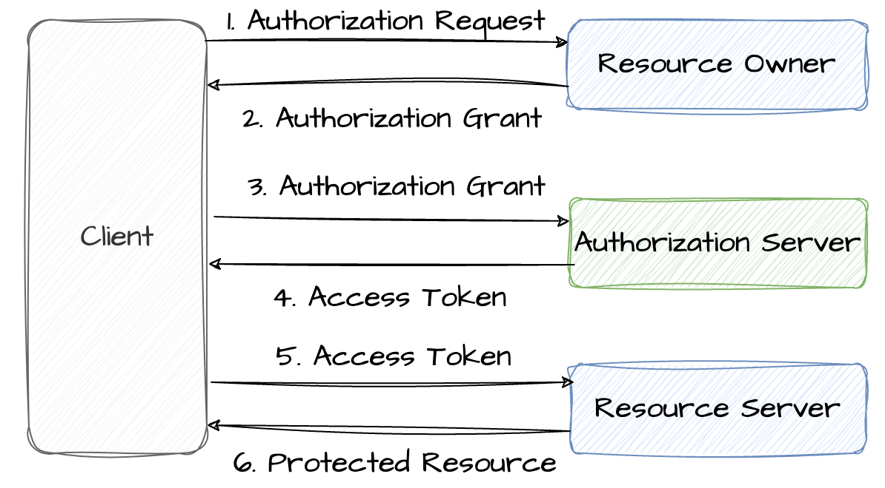
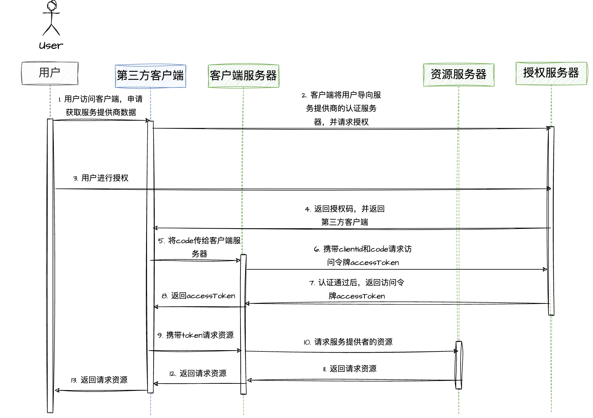
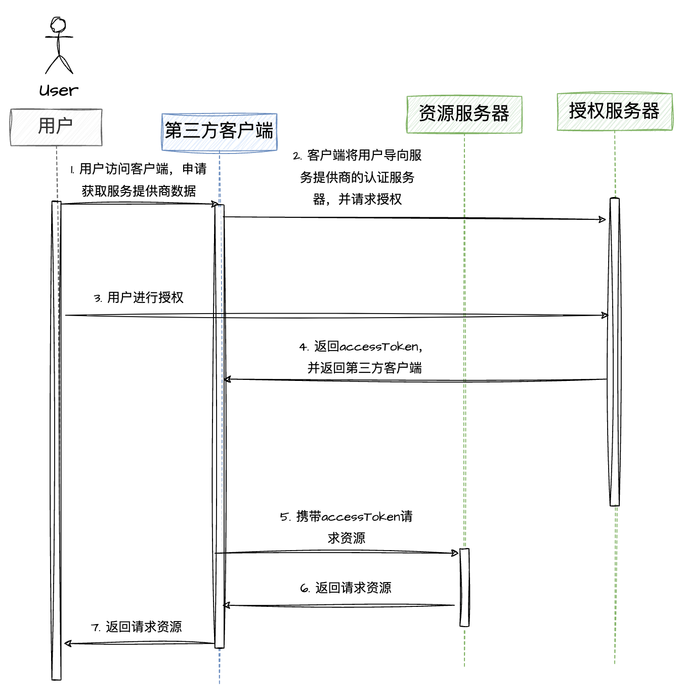
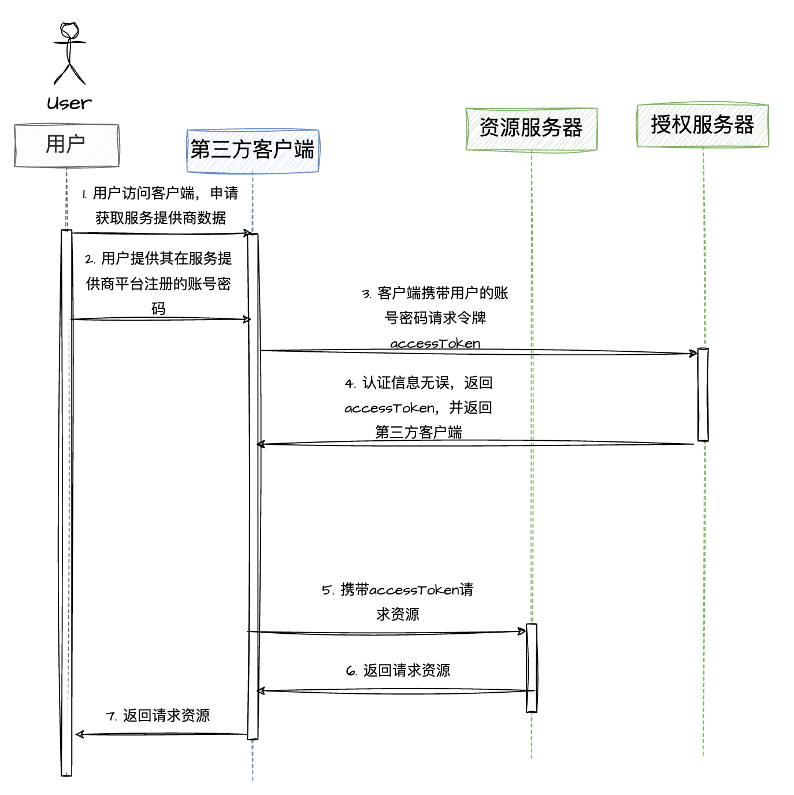
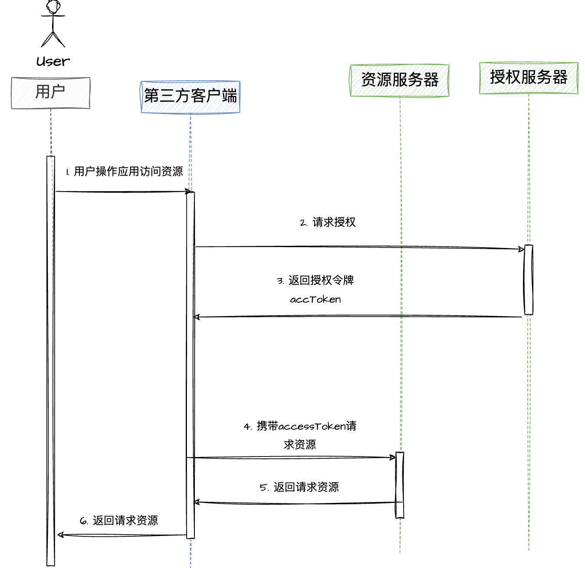

w# OAuth2 详解

# 一、OAuth2概述

在OAuth2.0中，"O"是Open的简称，所以OAuth表示开放授权，它是一个关于授权（Authorization）的开放网络标准。简单来说，OAuth2是一种授权协议。

OAuth2允许用户授权第三方应用访问用户存储在其他服务商内部的各种信息数据，而这种授权并不暴露给第三方应用用户的用户名和密码。

=> OAuth2.0这种授权协议，就是保证第三方应用只有在获得授权之后，才可以进一步访问授权者的数据。

# 二、OAuth2的作用

## 2.1 解决的问题

用户登录应用时传统的方式是用户直接进入客户端应用的登录界面输入账号密码，但是有的用户觉得注册后再登陆比较繁琐麻烦，于是用户会选择使用相关社交账号（QQ、WeChat等）登录，但是这种方式通过用户的账号密码去相关社交平台获取数据存在严重的问题缺陷：

1. 第三方应用想要获取WeChat中的用户信息，那么用户就把他的账号密码提供给第三方应用。可想而知，这种方式是非常不安全的 => 使用OAuth2.0可以避免向第三方暴露账号密码
2. 第三方应用拥有了用户微信的所有权限，用户没法限制第三方应用获得授权的范围和有效期 => OAuth2.0可以限制授权第三方应用获取微信部分功能，比如只可以获取用户信息，但不可以获取好友列表，有需求时再申请授权访问好友列表的权限
3. 用户只有修改密码，才能收回赋予第三方应用权限，但是这样做会使得其他所有获得用户授权的第三方应用程序全部失效
4. 只要有一个第三方应用程序被破解，就会导致用户密码泄漏，以及所有使用微信登录的应用的数据泄漏

=> OAuth的作用就是让第三方应用安全可控的获取用户的授权，与服务提供商交互，本质是使用token令牌替代用户账号密码。

## 2.2 应用场景

各大开放平台（如腾讯开放平台、阿里开放平台等大部分开放平台）都是使用OAuth2.0协议作为支撑：

- 客户端App使用第三方登录
- 微信小程序登录授权
- 多个服务统一登录认证中心，内部系统受保护资源的请求

# 三、OAuth2名词定义

1）第三方应用：获取资源服务器数据信息的角色

2）用户 / 资源所有者：需要允许或者拒绝第三方应用获得授权的角色

3）授权认证服务器：负责向第三方应用提供许可凭证code、令牌token等

4）资源服务器：提供给第三方应用注册接口，提供第三方应用appId,  appSecret，提供第三方应用开放资源的接口

# 四、OAuth2授权流程

## 4.1 OAuth2思想

OAuth 在 "第三方应用" 与 "服务提供商" 之间，设置了一个授权层。"第三方应用"不能直接登录"服务提供商"，只能登录授权层，以此将用户与客户端区分开来。"第三方应用"登录授权层所用的令牌（token）与用户的密码不同。用户可以在登录的时候，指定授权层令牌的权限范围和有效期。"第三方应用"登录授权层以后，"服务提供商" 根据令牌的权限范围和有效期，向 "第三方应用" 开放用户储存的资料。

## 4.2 交互流程

1. 用户打开第三方客户端后，第三方客户端要访问服务提供方，要求用户授权
2. 用户同意给予第三方客户端访问服务提供方的授权，并返回一个授权凭证code
3. 第三方应用使用code和身份认证信息(appId, appSecret)，向授权认证服务器申请授权令牌token
4. 授权认证服务器验证第三方客户端的授权凭证code和身份通过后，确认无误，同意授权，并返回一个资源访问的令牌token
5. 第三方客户端使用访问令牌token向资源服务器请求相关资源
6. 资源服务器验证访问令牌token后，将第三方客户端请求的资源放回，同意向客户端开放资源

# 五、OAuth2的授权模式

1. 授权码模式（Authorization Code）
2. 简化模式（Implicit）
3. 密码模式（resource owner password credentials）
4. 客户端模式（Client Credentials）

## 5.1 授权码模式

> 第三方应用先申请一个授权码，然后再使用该授权码获取令牌，最后使用令牌获取资源；授权码模式是功能最完整、流程最严密的授权模式。它的特点是通过客户端的后台服务器，与服务提供商的认证服务器进行交互。

流程步骤：

 **A [步骤 1,2]**：用户访问客户端，需要使用服务提供商的数据，触发客户端相关事件后，客户端拉起或重定向到服务提供商的页面或 APP

**B [步骤 3]**：用户选择是否给予第三方客户端授权访问服务提供商数据的权限

**C [步骤 4]**：用户同意授权，授权认证服务器将授权凭证 code 码返回给客户端，并且会拉起应用或重定（redirect_uri）向到第三方网站

**D [步骤 5,6]**: 客户端收到授权码后，将授权码 code 和 ClientId 或重定向 URI 发送给自己的服务器，客户端服务器再想认证服务器请求访问令牌 [access_token](https://so.csdn.net/so/search?q=access_token&spm=1001.2101.3001.7020)

**E [步骤 7,8]**：认证服务器核对了授权码和 ClientId 或重定向 URI，确认无误后，向客户端服务器发送访问令牌（access_token）和更新令牌（refresh_token），然后客户端服务器再发送给客户端

**F [步骤 9,10]**：客户端持有 access_token 和需要请求的参数向客户端服务器发起资源请求，然后客户端服务器再向服务提供商的资源服务器请求资源（web API）

**G [步骤 11,12,13]**：服务提供商的资源服务器返回数据给客户端服务器，然后再回传给客户端使用

## 5.2 简化模式

> 不需要获取授权码，第三方应用授权后授权认证服务器直接发送临牌给第三方应用，适用于静态网页应用，返回的 access_token 可见，access_token 容易泄露且不可刷新。

简化模式不通过第三方应用程序的服务器，直接在客户端中向认证服务器申请令牌，跳过了 "授权码" 这个步骤，因此得名。所有步骤在客户端中完成，令牌对访问者是可见的，且客户端不需要认证。

流程步骤：

- **A [步骤 1,2]**：用户访问客户端，需要使用服务提供商的数据，触发客户端相关事件后，客户端拉起或重定向到服务提供商的页面或 APP
- **B [步骤 3]**：用户选择是否给予第三方客户端授权访问服务提供商数据的权限
- **C [步骤 4]**：用户同意授权，授权认证服务器将访问令牌 access_token 返回给客户端，并且会拉起应用或重定（redirect_uri）向到第三方网站
- **D [步骤 5]**：第三方客户端向资源服务器发出请求资源的请求
- **E [步骤 6,7]**：服务提供商的资源服务器返回数据给客户端服务器，然后再回传给客户端使用

## 5.3 密码模式

> 如果你高度信任某个应用，允许用户把用户名和密码，直接告诉该应用。该应用就使用你的密码，申请令牌，这种方式称为 "密码式"

使用用户名 / 密码作为授权方式从授权服务器上获取令牌，一般不支持刷新令牌。这种方式风险很大，用户向客户端提供自己的用户名和密码。客户端使用这些信息，向 "服务商提供商" 索要授权。在这种模式中，用户必须把自己的密码给客户端，但是客户端不得储存密码。这通常用在用户对客户端高度信任的情况下，而认证服务器只有在其他授权模式无法执行的情况下，才能考虑使用这种模式。

流程步骤：

- **A [步骤 1,2]**：用户向第三方客户端提供，其在服务提供商那里注册的账户名和密码
- **B [步骤 3]**：客户端将用户名和密码发给认证服务器，向后者请求令牌 access_token
- **C [步骤 4]**：授权认证服务器确认身份无误后，向客户端提供访问令牌 access_token
- **D [步骤 5]**：第三方客户端向资源服务器发出请求资源的请求
- **E [步骤 6,7]**：服务提供商的资源服务器返回数据给客户端服务器，然后再回传给客户端使用

## 5.4 客户端模式

> 指客户端以自己的名义，而不是以用户的名义，向 "服务提供商" 进行认证。严格地说，客户端模式并不属于 OAuth 框架所要解决的问题。在这种模式中，用户直接向客户端注册，客户端以自己的名义要求 "服务提供商" 提供服务，其实不存在授权问题。

主要区别实在第 2 步和第 3 步：

- 客户端向授权认证服务器进行身份认证，并申请访问令牌token
- 授权认证服务器验证通过后，向客户端提供访问令牌
